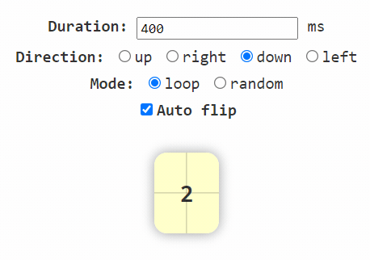
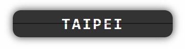

# flip.js

Flip.js is a HTML element for flipping child nodes.

---

## Demo

[url-demo-flip]: https://lf2com.github.io/flip.js/demo/flip
[url-demo-list]: https://lf2com.github.io/flip.js/demo/list
[url-demo-canvas]: https://lf2com.github.io/flip.js/demo/canvas

[Flip][url-demo-flip]

Sets flip properties of duration, direction, and mode.



[List][url-demo-list]

Flips items of list, you can arrange, add, and remove items.



[Canvas][url-demo-canvas]

Flips canvas candidates.


## Get Started

```html
<script defer src="https://unpkg.com/@lf2com/flip.js@latest/dist/flip.min.js"></script>
<!-- or -->
<script defer src="https://cdn.jsdelivr.net/gh/lf2com/flip.js@latest/dist/flip.min.js"></script>
```

Use flip in HTML:

```html
<flip-pack direction="down" mode="random">
  <div class="candidate">1</div>
  <div class="candidate">2</div>
  <div class="candidate">3</div>
  <div class="candidate">4</div>
  <div class="candidate">5</div>
</flip-pack>
```

Or in JavaScript code:

```js
  const flip = document.createElement('flip-pack');

  flip.setAttribute('direction', 'down');
  flip.setAttribute('mode', 'random');
  // or
  flip.direction = 'down';
  flip.mode = 'random';

  for (let i = 0; i < 5; i += 1) {
    const candidate = document.createElement('div');

    candidate.classList.add('candidate');
    candidate.innerText = `${i + 1}`;
    flip.append(candidate);
  }

  document.body.append(flip);
```

As flip.js is an element, we can code in jQuery:

```jq
$('<flip-pack>')
  .attr({
    direction: 'down',
    mode: 'random',
  })
  .append(new Array(5)
    .fill(0)
    .map((_, i) => (
      $('<div>')
        .addClass('candidate')
        .html(`${i + 1}`)
    ))
  )
  .appendTo($('body'));
</script>
```

Or in React:

```jsx
const Flip = () => (
  <flip-pack
    direction="down"
    mode="random"
  >
    {(new Array(5)
      .fill(0)
      .map((_, i) => (
        <div key={i} className="candidate">
          {i + 1}
        </div>
      ))
    )}
  </flip-pack>
);
```

## Styling Child Nodes

> :warning: _**On flipping, we clone the last and next candidate children for displaying flipping animation. So if the child nodes are styled by CSS, we need to let the cloned nodes styled as the same so that them can be displayed correctly. As a result, there are some rules for preventing from issues of flipping animation.**_

### Specific Selector of Parent

Selectors such as `flip-pack > {selector}` define those styles directly belong to `flip-pack`, causing missing the styles of cloned elements. It is recommended to use `flip-pack.some-class {selector}` instead.

```css
/*
 * [DO NOT USE]: flip-pack > {selector}
 */
flip-pack > .candidate {
  width: 100px;
  height: 150px;
  border-radius: 10px;
  background: #eee;
  font-size: 30px;
  color: #000;
}

/*
 * [BETTER TO USE]: flip-pack {selector}
 */
flip-pack.candidate-set-1 .candidate {
  width: 100px;
  height: 150px;
  border-radius: 10px;
  background: #eee;
  font-size: 30px;
  color: #000;
}
```

```html
<flip-pack class="candidate-set-1">
  <div class="candidate">A</div>
  <div class="candidate">B</div>
  <div class="candidate">C</div>
  <div class="candidate">D</div>
</flip-pack>
```

### Nth Selector

Selectors specifying the n-th node such as `:nth-child()` cause the cloned element being applied unexpected styles due to the cloned element would be the last child of `flip-pack`. 

```css
/*
 * [DO NOT USE]: flip-pack :nth-child()
 */
flip-pack .candidate:nth-child(odd) {
  background: #fee;
}

/*
 * [BETTER TO USE]: flip-pack {selector}
 */
flip-pack .candidate.odd {
  background: #fee;
}
```

```html
<flip-pack id="candidate-pack">
  <div class="candidate" value="a">A</div>
  <div class="candidate" value="b">B</div>
  <div class="candidate" value="c">C</div>
  <div class="candidate" value="d">D</div>
</flip-pack>
```

```js
document
  .getElementById('candidate-pack')
  .querySelectorAll('.candidate')
  .forEach((candidate, candidateIndex) => {
    if (candidateIndex % 2 === 0) {
      candidate.classList.add('odd');
    }
  });
```

## Build

Build flip.js with the command:

```sh
npm run build
```

And get the built file at `./dist/flip.min.js`.

## Nodes of Flip.js

Use `<flip-pack>` to wrap those child nodes for flipping:

```html
<flip-pack>
  <div value="a">A</div>
  <div value="b">B</div>
  <div value="c">C</div>
  <div value="d">D</div>
</flip-pack>
```

## Properties

Properties for setting the animation and current status of flip element.

### .candidates

> Type of value: _`HTMLElement`_[]
 
Returns the candidate elements that we can flip to.

```js
console.log('Candidates:', flip.candidates);
```

### .mode

> Type of value: _`string`_
>
> Default: `'loop'`

Mode of picking the next child element to show:

| Name | Description |
| -: | :- |
| loop | Pick the next candidate right after the current one |
| random | Pick candidate randomly |

```html
<!-- set mode -->
<flip-pack mode="random">
  <div>A</div>
  <div>B</div>
  <div>C</div>
  <div>D</div>
</flip-pack>
```

```js
// set mode of picking the next candidate
flip.mode = 'random';
// or
flip.setAttribute('mode', 'random');

// get mode of picking the next candidate
console.log('Mode:', flip.mode);
// or
console.log('Mode:', flip.getAttribute('mode'));
```

### .duration

> Type of value: _`number`_
>
> Default: _`400`_

Duration of animation flipping per candidate in milliseconds.

```html
<!-- set duration -->
<flip-pack duration="200">
  <div>A</div>
  <div>B</div>
  <div>C</div>
  <div>D</div>
</flip-pack>
```

```js
// set duration of animation
flip.duration = 200;
// or
flip.setAttribute('duration', '200');

// get duration in number
console.log('Duration:', flip.duration);
// or in string
console.log('Duration:', flip.getAttribute('duration'));
```

### .direction

> Type of value: _`string`_
>
> Default: _`'down'`_

Direction of flipping candidates:

| Name | Description |
| -: | :- |
| down | Flipping down from the top side |
| up | Flipping up from the bottom side |
| left | Flipping left from the right side |
| right | Flipping right from the left side |

```html
<!-- set direction -->
<flip-pack direction="left">
  <div>A</div>
  <div>B</div>
  <div>C</div>
  <div>D</div>
</flip-pack>
```

```js
// set direction
flip.direction = 'left';
// or
flip.setAttribute('direction', 'left');

// get direction
console.log('Direction:', flip.direction);
// or
console.log('Direction:', flip.getAttribute('direction'));
```

### .minFlips/.maxFlips

> Type of value: _`number`_
>
> Default: _`0`_ for `minFlips`; _`Infinity`_ for `maxFlips`

Minimum or maximum times of flipping candidates on `random` mode.

```html
<!-- set min/max flips -->
<flip-pack mode="random" min-flips="5" max-flips="8">
  <div>A</div>
  <div>B</div>
  <div>C</div>
  <div>D</div>
</flip-pack>
```

```js
// set min/max flips
flip.minFlips = 5;
flip.maxFlips = 8;
// or
flip.setAttribute('min-flips', '5');
flip.setAttribute('max-flips', '8');

// get min/max flips in number
console.log('Min flips:', flip.minFlips);
console.log('Max flips:', flip.maxFlips);
// or in string
console.log('Min flips:', flip.getAttribute('minFlips'));
console.log('Max flips:', flip.getAttribute('maxFlips'));
```

### .perspective

> Type of value: _`string`_
>
> Default: _`2 * Math.max({width_of_candidate}, {height_of_candidate})`_

CSS 3D perspective of flipping animation.

```html
<!-- set perspective -->
<flip-pack perspective="50vmin">
  <div>A</div>
  <div>B</div>
  <div>C</div>
  <div>D</div>
</flip-pack>
```

```js
// set perspective
flip.perspective = '50vmin';
// or
flip.setAttribute('perspective', '50vmin');

// get perspective
console.log('CSS perspective:', flip.perspective);
// or
console.log('CSS perspective:', flip.getAttribute('perspective'));
```

### .index

> Type of value: _`number`_
>
> Default: _`0`_ if there is at least 1 candidate. Otherwise _`-1`_.

Index of current candidate. Set index to change the current displayed candidate without flipping animation.

> :warning: _**If we assign both [`index`](#index) and [`value`](#value) on HTML attributes, we would apply the value of `index` instead of `value`.**_

```html
<!-- initial index -->
<flip-pack index="2">
  <div>A</div>
  <div>B</div>
  <div>C</div>
  <div>D</div>
</flip-pack>
```

```js
// set index
flip.index = 2;
// or
flip.setAttribute('index', '2');

// get index in number
console.log('Current index:', flip.index);
// or in string
console.log('Current index:', flip.getAttribute('index'));
```

### .value

> Type of value: _`string` | `null`_

Value of current candidate. Set value of candidate candidates to change the current displayed candidate without flipping animation.

> :warning: _**If we assign both [`index`](#index) and [`value`](#value) on HTML attributes, we would apply the value of `index` instead of `value`.**_

```html
<!-- set value -->
<flip-pack value="c">
  <div value="a">A</div>
  <div value="b">B</div>
  <div value="c">C</div>
  <div value="d">D</div>
</flip-pack>
```

```js
// set value
flip.value = 'c';
// or
flip.setAttribute('value', 'c');

// get value
console.log('Current value:', flip.value);
// or
console.log('Current value:', flip.getAttribute('value'));
```

### .candidate

> Type of value: _`HTMLElement` | `null`_

Current displayed candidate. Set an candidate element to change the current displayed candidate without flipping.

```html
<flip-pack>
  <div value="a">A</div>
  <div value="b">B</div>
  <div value="c">C</div>
  <div value="d">D</div>
</flip-pack>
```

```js
// set candidate
flip.candidate = flip.querySelector('[value="d"]');

// get candidate
console.log('Current candidate:', flip.candidate);
```

## Methods

Flip methods deal with those related to flip.

### Static

#### Flip.getCandidateValue(_candidate_)

| Argument | Type | Description |
| -: | :-: | :- |
| candidate | _HTMLElement_ | Candidate element |

Returns the value of candidate element. The value is the same as the attribute value of `value`.

```html
<flip-pack>
  <div value="a">A</div>
  <div value="b">B</div>
  <div value="c">C</div>
  <div value="d">D</div>
</flip-pack>
```

```js
// get candidate value: 'a'
console.log('Value:', Flip.getCandidateValue(flip.firstElementChild()));
```

#### .flipAnimation(_options_)

Applies flipping animation based on `options`.

Properties of `options`:

| Name | Type | Description |
| -: | :-: | :- |
| direction | _[Direction](#direction)_ | Direction of flipping animation |
| duration | _number_ | Duration of flipping per candidate |
| minFlips | _number_ | Minimum times of flipping passed candidates |
| maxFlips | _number_ | Maximum times of flipping passed candidates |
| perspective | _string_ | CSS 3D perspective value for flipping animation |
| lastCandidateInfo | _[CandidateInfo](#getcandidateinfosource)_ | Object of current candidate info |
| nextCandidateInfo | _[CandidateInfo](#getcandidateinfosource)_ | Object of target candidate info |
| tempCandidateNode | _HTMLElement_ | Temporary element for handling flipping animation |

### Instance

#### .getCandidateNode(_source_)

Returns the candidate element by any of the following types:

| Type | Description |
| :-: | :- |
| _number_ | Index of candidate |
| _string_ | Value of candidate |

#### .getCandidateIndex(_source_)

Returns the candidate index by any of the following types:

| Type | Description |
| :-: | :- |
| _string_ | Value of candidate |
| _HTMLElement_ | Element of candidate |

#### .getCandidateValue(_source_)

Returns the candidate value by any of the following types:

| Type | Description |
| :-: | :- |
| _number_ | Index of candidate |
| _HTMLElement_ | Element of candidate |

#### .getCandidateInfo(_source_)

Returns the object of candidate info by any of the following types:

| Type | Description |
| :-: | :- |
| _number_ | Index of candidate |
| _string_ | Value of candidate |
| _HTMLElement_ | Element of candidate |

Properties of candidate info:

| Argument | Type | Description |
| -: | :-: | :- |
| index | _number_ | Index of candidate |
| value | _string \| null_ | Value of candidate |
| node | _HTMLElement \| null_ | Element of candidate |

#### .getNextCandidateIndex(_options?_)

Returns the next candidate index with `options`:

| Name | Type | Description |
| -: | :-: | :- |
| mode? | _[Mode](#mode)_ | Mode of picking candidate |

#### .getNextCandidateNode(_options?_)

Returns the next candidate element with `options`. The properties of `options` are the same as [`.getNextCandidateIndex`](#getnextcandidateindexoptions).

#### .getNextCandidateValue(_options?_)

Returns the next candidate value with `options`. The properties of `options` are the same as [`.getNextCandidateIndex`](#getnextcandidateindexoptions).

#### .getNextCandidateInfo(_options?_)

Returns the object of next candidate info with `options`. The properties of `options` are the same as [`.getNextCandidateIndex`](#getnextcandidateindexoptions).

#### .flip(_source?_, _options?_)

Flips to the specific candidate by any of the following types:

| Type | Description |
| :-: | :- |
| _number_ | Index of candidate |
| _string_ | Value of candidate |
| _HTMLElement_ | Element of candidate |

Properties of `options` extend that of [`.getNextCandidateIndex`](#getnextcandidateindexoptions):

| Name | Type | Description |
| -: | :-: | :- |
| direction? | _[Direction](#direction)_ | Direction of flipping animation |
| duration? | _number_ | Duration of flipping per candidate |
| minFlips? | _number_ | Minimum times of flipping passed candidates |
| maxFlips? | _number_ | Maximum times of flipping passed candidates |
| perspective? | _string_ | CSS 3D perspective value for flipping animation |

```js
// use await to wait until flipping animation ends
await flip.flip({
  maxFlips: 0,
});
```

#### .flip(_options?_)

Flips to the defaul next candidate with the same `options` as [`.flip`](#flipsource-options).

## Events

Events for flip elements:

### flipstart

> **Cancelable: `true`**
>
> Would not switch to target candidate if the event is canceled.

Dispatches on starting of switching candidate.

Values of `event.detail`:

| Name | Type | Description |
| -: | :-: | :- |
| mode | _[Mode](#mode)_ | Mode of flipping |
| direction | _[Direction](#direction)_ | Direction of flipping animation |
| duration | _number_ | Duration of flipping per candidate |
| minFlips | _number_ | Minimum times of flipping passed candidates |
| maxFlips | _number_ | Maximum times of flipping passed candidates |
| perspective | _string_ | CSS 3D perspective value for flipping animation |
| lastCandidateInfo | _[CandidateInfo](#getcandidateinfosource)_ | Object of current candidate info |
| targetCandidateInfo | _[CandidateInfo](#getcandidateinfosource)_ | Object of target candidate info |

### flipend

> **Cancelable: `false`**

Dispatches on the end of switching candidate.

Properties of `event.detail` is the same as [flipstart](#flipstart).

### flipcandidatestart

> **Cancelable: `true`**
>
> Would not display flipping animation if the event is canceled.

Dispatches on starting of flipping animation.

Properties of `event.detail` extend that of [flipstart](#flipstart):

| Name | Type | Description |
| -: | :-: | :- |
| tempCandidateNode | _HTMLElement_ | Temporary element for handleing animation of flipping |

### flipcandidateend

> **Cancelable: `false`**

Dispatchse on the end of flipping animation.

Properties of `event.detail` is the same as [flipcandidatestart](#flipcandidatestart).

## License

[url-license]: https://github.com/lf2com/flip.js/blob/master/LICENSE

Flip.js is [MIT licensed][url-license].
